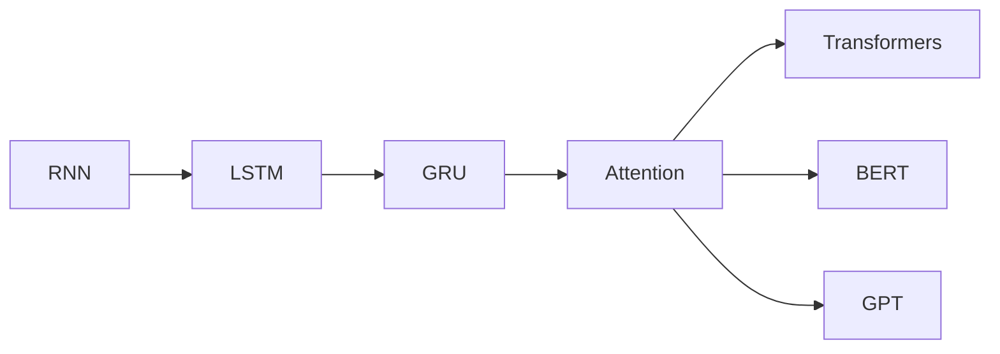

# 🤔 Why Transformers?

> Understanding the problem Transformers were designed to solve.

---
## 📊 Evolution of NLP



# The NLP Journey

Before Transformers:

```text
RNN

↓

LSTM

↓

GRU

↓

Transformers
```

Each generation attempted to solve limitations of the previous one.

---

# Recurrent Neural Networks (RNNs)

RNNs process tokens sequentially.

Example:

```text
I

↓

love

↓

AI
```

Architecture:

```text
Word1

↓

Hidden State

↓

Word2

↓

Hidden State

↓

Word3
```

---

# Problems with RNNs

## Long-Term Dependencies

Sentence:

```text
The cat sitting on the roof suddenly fell.
```

To understand:

```text
fell
```

the model must remember:

```text
cat
```

from many steps earlier.

This becomes difficult for long sequences.

---

## Slow Training

RNNs process one token at a time.

```text
Token1

↓

Token2

↓

Token3
```

Cannot efficiently parallelize.

---

# Long-Term Dependency Problem

Example:

```text
The animal didn't cross the road because it was tired.
```

Question:

```text
What does "it" refer to?
```

Humans know:

```text
animal
```

Traditional models often struggle.

---

# LSTM

LSTM introduced memory cells.

Advantages:

* Better memory
* Reduced vanishing gradients

However:

* Still sequential
* Still slow
* Difficult to scale

---

# Birth of Attention

Researchers asked:

Instead of remembering everything,

why not directly look at important words?

This idea became:

```text
Attention
```

---

# Transformer Revolution

Paper:

```text
Attention Is All You Need
(2017)
```

Core Idea:

```text
Every token can attend
to every other token.
```

Example:

```text
The ↔ cat ↔ sat ↔ on ↔ mat
```

All relationships can be learned simultaneously.

---

# Advantages of Transformers

### Parallel Processing

All tokens processed together.

### Better Context

Captures long-range dependencies.

### Scalability

Works effectively on huge datasets.

### State-of-the-Art Performance

Powers modern LLMs.

---

# Impact

Transformers enabled:

* BERT
* GPT
* ChatGPT
* Claude
* Gemini
* LLaMA

---

# Key Takeaways

* RNNs struggled with long sequences.
* LSTMs improved memory but remained sequential.
* Attention solved context problems.
* Transformers made large-scale language modeling possible.
