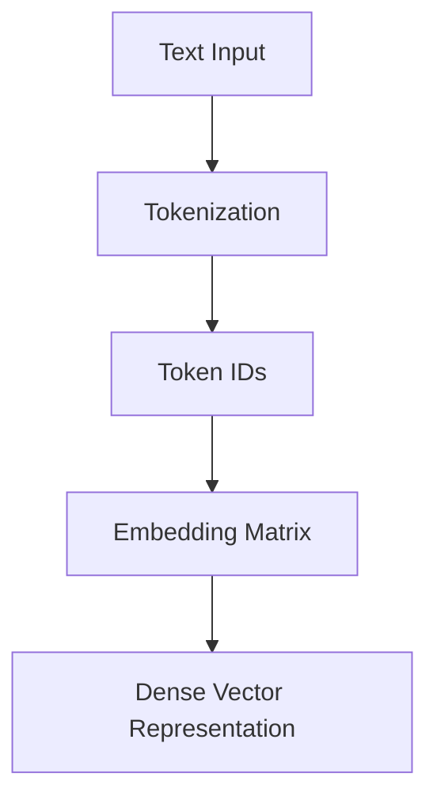

# 🔤 Embeddings

> How machines convert words into numbers they can understand.

---
## 📊 Word Embedding Pipeline



# Why Do We Need Embeddings?

Computers do not understand words.

Example:

```text
Cat
Dog
King
Queen
```

A computer only understands numbers.

We therefore convert words into vectors.

---

# Naive Encoding

Example:

```text
Cat = 1

Dog = 2

King = 3
```

Problem:

```text
King > Cat
```

has no real meaning.

Relationships are lost.

---

# One-Hot Encoding

Example Vocabulary:

```text
Cat
Dog
Bird
```

Representations:

```text
Cat  = [1,0,0]

Dog  = [0,1,0]

Bird = [0,0,1]
```

---

# Problems with One-Hot Encoding

* Sparse vectors
* Large memory usage
* No semantic meaning

Example:

```text
Cat and Dog
```

appear equally distant from:

```text
King
```

---

# Word Embeddings

Embeddings solve this problem.

Example:

```text
Cat

↓

[0.12, 0.82, 0.55, 0.33]
```

Each word becomes a dense vector.

---

# Semantic Relationships

Embeddings learn meaning.

Example:

```text
King - Man + Woman

≈

Queen
```

Another:

```text
Paris - France + Germany

≈

Berlin
```

---

# Embedding Space

Words with similar meanings appear closer.

```text
Dog ── Cat

Horse

Tiger


King ── Queen
```

Distance reflects semantic similarity.

---

# Tokenization

Before embeddings:

```text
I love AI
```

becomes:

```text
["I", "love", "AI"]
```

or

```text
[101, 456, 789]
```

These IDs are converted into embeddings.

---

# Embedding Layer

Architecture:

```text
Token IDs

↓

Embedding Matrix

↓

Dense Vectors
```

---

# Example

Vocabulary Size:

```text
10,000
```

Embedding Dimension:

```text
512
```

Embedding Matrix:

```text
10000 × 512
```

Each row represents a word.

---

# Transformer Input

Input to a Transformer:

```text
Token Embedding

+

Positional Encoding
```

Result:

```text
Final Embedding
```

---

# Why Embeddings Matter

Without embeddings:

* No semantic understanding
* Poor language modeling

With embeddings:

* Similar words cluster together
* Better contextual understanding
* Foundation for Attention

---

# Key Takeaways

* Words must be converted into vectors.
* One-Hot Encoding is inefficient.
* Embeddings capture semantic meaning.
* Embeddings are learned during training.
* Every Transformer begins with embeddings.
