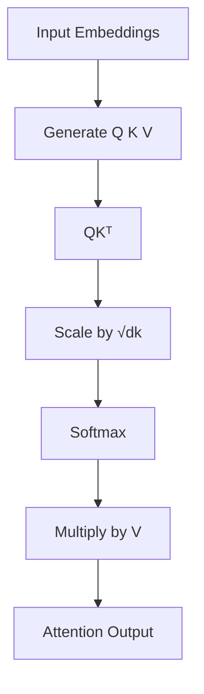

# ⚡ Attention Mechanism

> The core idea that made Transformers possible.

---

# What Problem Does Attention Solve?

Before Attention, models like RNNs and LSTMs processed text sequentially.

Example:

```text
The cat sitting on the roof suddenly fell.
```

To understand the word:

```text
fell
```

the model must remember:

```text
cat
```

from many steps earlier.

As sequences become longer, remembering important information becomes difficult.

This problem is called:

* Long-Term Dependency Problem

Attention solves this by allowing a model to directly look at relevant words regardless of distance.

---

# Intuition

Imagine reading:

```text
The animal didn't cross the road because it was tired.
```

When processing:

```text
it
```

you naturally connect it with:

```text
animal
```

rather than:

```text
road
```

Attention helps neural networks learn this behavior.

---

# Basic Idea

Instead of treating every word equally:

```text
Word1 Word2 Word3 Word4
```

the model assigns importance scores.

Example:

```text
Word1 = 0.05
Word2 = 0.15
Word3 = 0.70
Word4 = 0.10
```

Word3 receives the most attention.

---

# Query, Key, and Value

Every token produces three vectors:

```text
Query (Q)
Key (K)
Value (V)
```

Think of them as:

Query → What am I looking for?

Key → What information do I contain?

Value → Actual information I provide

---
## Attention Flow



# Attention Workflow

```text
Input Embeddings
        │
        ▼

Generate Q K V

        │
        ▼

Compute Similarity

        │
        ▼

Apply Softmax

        │
        ▼

Weighted Sum

        │
        ▼

Output
```

---

# Mathematical Formula

```text
Attention(Q,K,V)

=

softmax(
QKᵀ
─────
√dk
)

V
```

---

# Formula Breakdown

## Step 1

Compute similarity scores:

```text
QKᵀ
```

This measures how strongly tokens are related.

---

## Step 2

Scale scores:

```text
QKᵀ
─────
√dk
```

Prevents large values from dominating Softmax.

---

## Step 3

Apply Softmax:

```text
softmax(scores)
```

Converts scores into probabilities.

Example:

```text
[2.5, 1.0, 0.5]

↓

[0.72, 0.18, 0.10]
```

---

## Step 4

Multiply by V

Weighted information is aggregated.

Result:

```text
Context Vector
```

---

# Why Attention Works

Advantages:

* Handles long-range dependencies
* Parallelizable
* Learns contextual relationships
* Forms foundation of Transformers

---

# Complexity

Attention Complexity:

```text
O(n²)
```

because every token interacts with every other token.

This motivates modern research such as:

* Flash Attention
* Sparse Attention
* Linear Attention

---

# Key Takeaways

* Attention learns relationships between tokens.
* Uses Query, Key, and Value vectors.
* Produces context-aware representations.
* Forms the foundation of modern LLMs.
