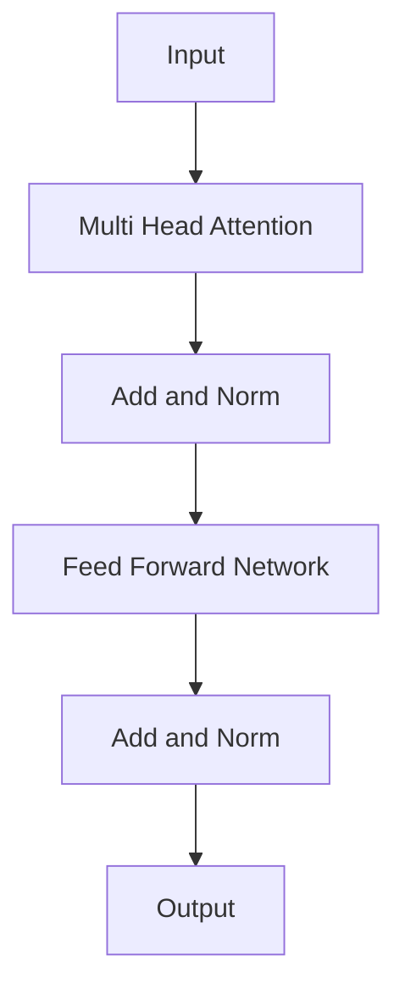

# 🏗 Encoder

> The component responsible for understanding and encoding input text.

---
## 📊 Encoder Block



# Role of the Encoder

Input:

```text
The cat sat on the mat
```

Output:

```text
Rich contextual representation
```

The encoder does NOT generate text.

Its job is:

```text
Understand
Represent
Encode
```

---

# Encoder Architecture

```text
Input Embeddings

        │

        ▼

Positional Encoding

        │

        ▼

Multi Head Attention

        │

        ▼

Add & Norm

        │

        ▼

Feed Forward Network

        │

        ▼

Add & Norm

        │

        ▼

Encoder Output
```

---

# Component 1: Multi-Head Attention

Allows every token to interact with every other token.

Example:

```text
The cat sat on the mat
```

"sat" may attend strongly to:

```text
cat
```

and

```text
mat
```

---

# Component 2: Residual Connection

Instead of:

```text
Output = Layer(x)
```

Use:

```text
Output = x + Layer(x)
```

Purpose:

* Better gradient flow
* Easier training
* Prevents information loss

---

# Component 3: Layer Normalization

Normalizes activations.

Formula:

```text
(x - mean)
/ std
```

Benefits:

* Stable training
* Faster convergence

---

# Component 4: Feed Forward Network

Architecture:

```text
Linear

↓

GELU

↓

Linear
```

Example:

```text
768

↓

3072

↓

768
```

Each token is processed independently.

---

# Encoder Layer

Single Encoder:

```text
MHA

↓

Add & Norm

↓

FFN

↓

Add & Norm
```

---

# Stacking Encoders

Transformer Paper:

```text
6 Encoder Layers
```

BERT Base:

```text
12 Layers
```

BERT Large:

```text
24 Layers
```

---

# Output Representation

Every token receives:

```text
Context-Aware Embedding
```

Example:

```text
bank
```

In:

```text
river bank
```

and

```text
bank account
```

different contextual representations are learned.

---

# Key Takeaways

* Encoder builds contextual understanding.
* Uses MHA + FFN.
* Stacked multiple times.
* Produces rich token representations.
