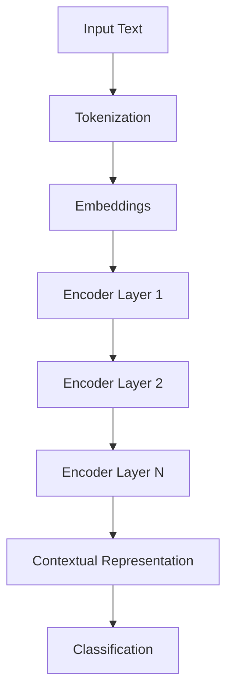

# 🧠 BERT

> Bidirectional Encoder Representations from Transformers

Google Research (2018)

---
## 📊 BERT Architecture



# What Is BERT?

BERT is an Encoder-Only Transformer.

Architecture:

```text
Input

↓

Encoder Stack

↓

Output Representation
```

No Decoder.

No Text Generation.

---

# Main Idea

Traditional models read:

```text
Left → Right
```

BERT reads:

```text
Left ↔ Right
```

simultaneously.

---

# Example

Sentence:

```text
The bank is near the river.
```

BERT uses both:

```text
The
bank
is
near
the
river
```

to understand:

```text
bank
```

means:

```text
river bank
```

not

```text
financial institution
```

---

# BERT Training

Uses:

```text
Masked Language Modeling
```

Example:

```text
I love [MASK]
```

Model predicts:

```text
AI
```

---

# Next Sentence Prediction

Original BERT task:

```text
Sentence A

Sentence B
```

Predict:

```text
Related?

or

Not Related?
```

---

# Architecture

BERT Base:

```text
12 Layers

12 Heads

768 Hidden Size
```

BERT Large:

```text
24 Layers

16 Heads

1024 Hidden Size
```

---

# Applications

* Sentiment Analysis
* Classification
* Search
* Named Entity Recognition
* Question Answering

---

# Variants

* RoBERTa
* DistilBERT
* ALBERT
* DeBERTa

---

# Strengths

* Strong language understanding
* Excellent embeddings
* Bidirectional context

---

# Limitation

Cannot generate text like GPT.

---

# Key Takeaways

* Encoder-only model.
* Trained using Masked Language Modeling.
* Excellent for NLP understanding tasks.
