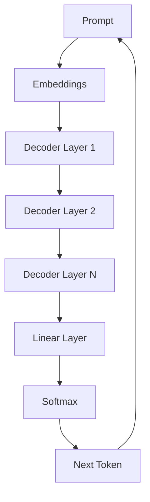

# 🚀 GPT

> Generative Pretrained Transformer

OpenAI

---
## 📊 GPT Architecture



# What Is GPT?

GPT is a Decoder-Only Transformer.

Architecture:

```text
Input

↓

Decoder Stack

↓

Next Token Prediction
```

---

# Main Goal

Predict the next token.

Example:

```text
I love
```

Predict:

```text
AI
```

Then:

```text
I love AI
```

Predict next token again.

---

# Training Objective

```text
P(
next token
|
previous tokens
)
```

---

# Why GPT Works

Uses:

```text
Masked Self Attention
```

Model only sees previous tokens.

---

# GPT Evolution

GPT-1

```text
117M Parameters
```

GPT-2

```text
1.5B Parameters
```

GPT-3

```text
175B Parameters
```

GPT-4

```text
Trillions (estimated)
```

---

# Architecture

```text
Input Tokens

↓

Embeddings

↓

Positional Encoding

↓

Decoder Layers

↓

Linear Layer

↓

Softmax

↓

Next Token
```

---

# Strengths

* Text Generation
* Coding
* Summarization
* Translation
* Conversation

---

# Why ChatGPT Uses GPT

Because GPT excels at generation.

BERT understands.

GPT generates.

---

# Key Takeaways

* Decoder-only Transformer.
* Trained on next-token prediction.
* Foundation of ChatGPT and modern assistants.
