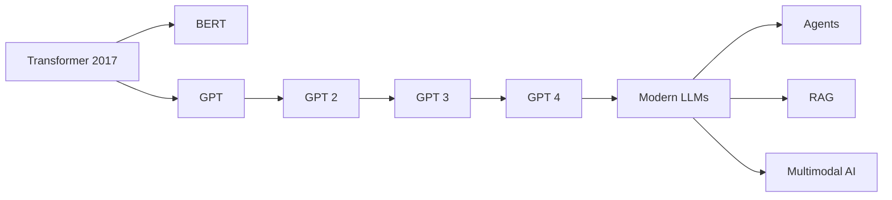

# 🌎 Modern Large Language Models

> Evolution from Transformers to state-of-the-art AI systems.

---
## 📊 Evolution of LLMs



# LLM Evolution

```text
Transformer (2017)

↓

BERT

↓

GPT

↓

Modern LLMs
```

---

# Modern LLM Components

Most models include:

* Transformer Architecture
* Massive Datasets
* Large Parameter Counts
* Instruction Tuning
* RLHF
* Long Context Windows

---

# Popular Models

## GPT Series

* GPT-3
* GPT-4
* GPT-4o

Focus:

```text
General Intelligence
```

---

## Claude

Focus:

```text
Reasoning
Safety
Long Context
```

---

## Gemini

Focus:

```text
Multimodal AI
```

Supports:

* Text
* Images
* Video
* Audio

---

## LLaMA

Meta's open model family.

Popular for:

* Research
* Fine-Tuning
* Open Source

---

## DeepSeek

Known for:

* Efficient reasoning
* Cost efficiency

---

# Modern Innovations

## RoPE

Improved positional encoding.

---

## Mixture of Experts

Only some parameters activate.

Benefits:

* Faster inference
* Better scaling

---

## Long Context Windows

Examples:

```text
32K

128K

1M+
```

tokens.

---

# Current Research Areas

* Reasoning
* Agents
* Memory Systems
* Multimodal AI
* Tool Usage
* Autonomous Workflows

---

# Key Takeaways

* Modern LLMs are advanced Transformer systems.
* Most innovations still build on Attention.
* Transformers remain the foundation of AI.
