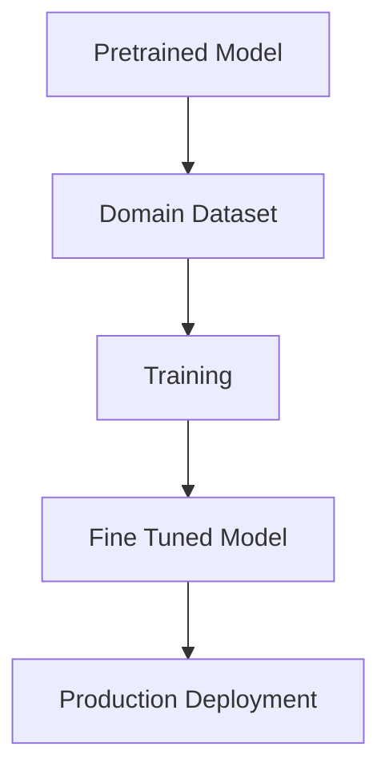

# 🎯 Fine-Tuning

> Teaching a pre-trained model to specialize in a new task.

---
## 📊 Fine Tuning Workflow



# What Is Fine-Tuning?

A model learns general knowledge during pretraining.

Example:

```text
Internet Data
```

↓

```text
General Language Model
```

Fine-tuning teaches:

```text
Medical Domain

Legal Domain

Finance Domain
```

---

# Why Fine-Tune?

Instead of training from scratch:

```text
Cost = Extremely High
```

Reuse a pre-trained model.

---

# Fine-Tuning Pipeline

```text
Pretrained Model

↓

Task Dataset

↓

Training

↓

Fine-Tuned Model
```

---

# Example

Input:

```text
Patient has fever and cough.
```

Output:

```text
Possible respiratory infection.
```

Model learns medical patterns.

---

# Types of Fine-Tuning

## Full Fine-Tuning

Update:

```text
All Parameters
```

Pros:

* Maximum performance

Cons:

* Expensive

---

## Parameter Efficient Fine-Tuning (PEFT)

Update:

```text
Small subset
```

Pros:

* Cheap
* Fast

---

# Instruction Tuning

Train model using:

```text
Instruction

↓

Response
```

Example:

```text
Summarize this article.
```

↓

```text
Summary
```

This makes models follow instructions better.

---

# Fine-Tuning Challenges

* Overfitting
* Catastrophic Forgetting
* Dataset Quality
* Compute Cost

---

# Fine-Tuning vs RAG

Fine-Tuning:

```text
Changes model weights
```

RAG:

```text
Retrieves external knowledge
```

---

# Real-World Use Cases

* Customer Support
* Healthcare
* Finance
* Legal AI
* Coding Assistants

---

# What's Next?

After Fine-Tuning:

```text
LoRA

↓

QLoRA

↓

RLHF

↓

RAG

↓

Agentic AI
```

---

# Key Takeaways

* Fine-tuning specializes models.
* Usually starts from a pretrained model.
* PEFT methods reduce cost dramatically.
* Foundation for production AI systems.
