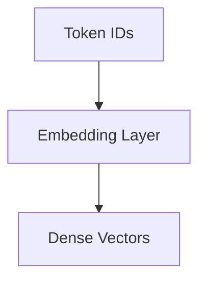
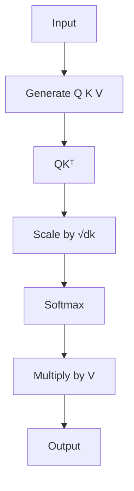
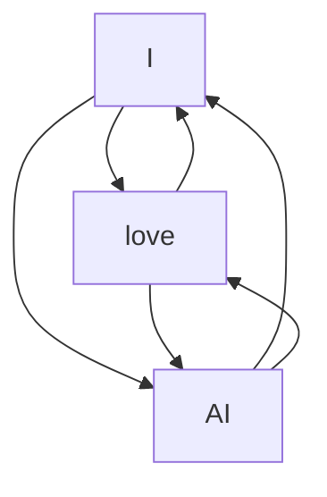
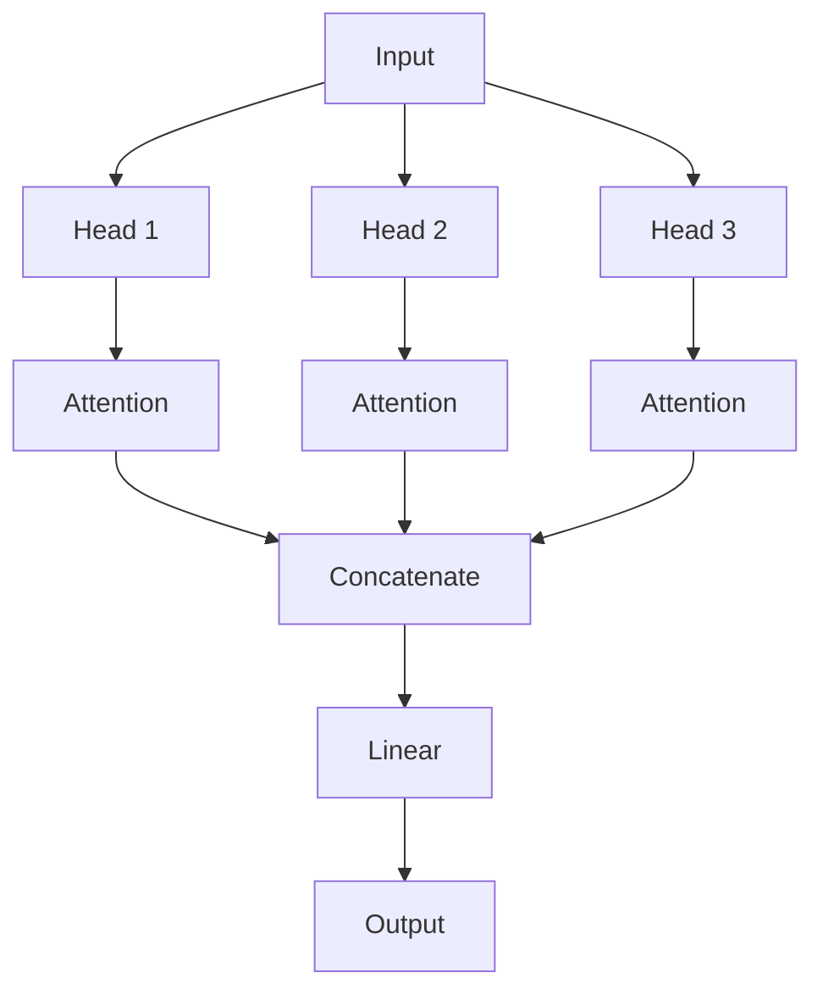
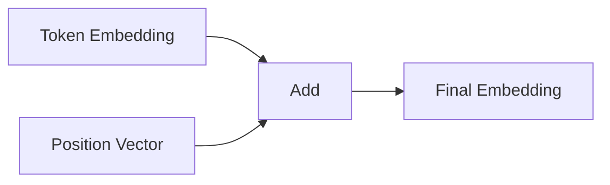
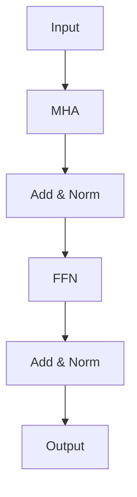
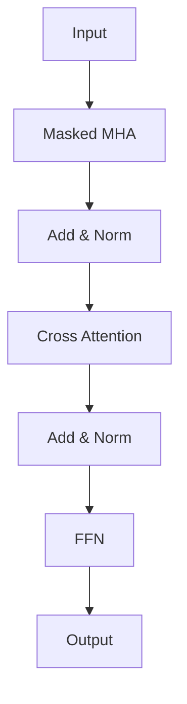
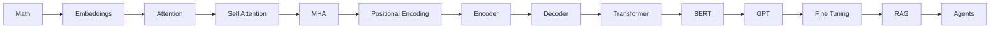

# 🐍 Python for Transformers

> A complete hands-on guide to understanding and implementing Transformers using NumPy, PyTorch, and Hugging Face.

---

# 📚 Table of Contents

1. NumPy Basics
2. Vectors and Matrices
3. Dot Product
4. Softmax
5. Embeddings
6. Attention
7. Self-Attention
8. Multi-Head Attention
9. Positional Encoding
10. Encoder Block
11. Decoder Block
12. Complete Transformer
13. Hugging Face Transformers
14. GPT Text Generation
15. Mini GPT Block
16. Interview Questions

---

# 1️⃣ NumPy Basics

```python
import numpy as np

x = np.array([1, 2, 3])

print(x)
print(x.shape)
```

Output:

```text
[1 2 3]
(3,)
```

---

# 2️⃣ Vectors and Matrices

```python
import numpy as np

vector = np.array([1,2,3])

matrix = np.array([
    [1,2,3],
    [4,5,6]
])

print(vector)
print(matrix)
```

---

# 3️⃣ Dot Product

```python
import numpy as np

A = np.array([1,2])
B = np.array([3,4])

print(np.dot(A,B))
```

---

# 4️⃣ Softmax

```python
import numpy as np

def softmax(x):
    exp_x = np.exp(x)
    return exp_x / np.sum(exp_x)

x = np.array([2,1,0])

print(softmax(x))
```

---

# 5️⃣ Embeddings



```python
import torch
import torch.nn as nn

embedding = nn.Embedding(10000,512)

tokens = torch.tensor([5,12,100])

output = embedding(tokens)

print(output.shape)
```

---

# 6️⃣ Attention From Scratch

Formula:

```text
Attention(Q,K,V) = softmax(QKᵀ/√dk)V
```



```python
import torch
import torch.nn.functional as F

Q = torch.rand(3,4)
K = torch.rand(3,4)
V = torch.rand(3,4)

scores = torch.matmul(Q,K.T)
scores = scores / (K.shape[-1] ** 0.5)

weights = F.softmax(scores, dim=-1)

output = torch.matmul(weights,V)

print(output)
```
---

# 7️⃣ Self-Attention



```python
import torch
import torch.nn as nn

class SelfAttention(nn.Module):

    def __init__(self, embed_size):
        super().__init__()

        self.Wq = nn.Linear(embed_size, embed_size)
        self.Wk = nn.Linear(embed_size, embed_size)
        self.Wv = nn.Linear(embed_size, embed_size)

    def forward(self,x):

        Q = self.Wq(x)
        K = self.Wk(x)
        V = self.Wv(x)

        scores = torch.matmul(Q,K.transpose(-2,-1))
        scores /= K.shape[-1]**0.5

        attention = torch.softmax(scores,dim=-1)

        return torch.matmul(attention,V)
```

---

# 8️⃣ Multi-Head Attention



```python
import torch
import torch.nn as nn

mha = nn.MultiheadAttention(
    embed_dim=512,
    num_heads=8,
    batch_first=True
)

x = torch.rand(2,10,512)

output,_ = mha(x,x,x)

print(output.shape)
```

---

# 9️⃣ Positional Encoding



```python
import torch
import math

def positional_encoding(max_len,d_model):

    pe = torch.zeros(max_len,d_model)

    position = torch.arange(0,max_len).unsqueeze(1)

    div_term = torch.exp(
        torch.arange(0,d_model,2)
        * (-math.log(10000.0)/d_model)
    )

    pe[:,0::2] = torch.sin(position*div_term)
    pe[:,1::2] = torch.cos(position*div_term)

    return pe
```

---

# 🔟 Encoder Block



```python
import torch
import torch.nn as nn

encoder = nn.TransformerEncoderLayer(
    d_model=512,
    nhead=8
)
```

---

# 1️⃣1️⃣ Decoder Block



```python
decoder = nn.TransformerDecoderLayer(
    d_model=512,
    nhead=8
)
```

---

# 1️⃣2️⃣ Complete Transformer

```python
import torch
import torch.nn as nn

transformer = nn.Transformer(
    d_model=512,
    nhead=8,
    num_encoder_layers=6,
    num_decoder_layers=6
)
```

---

# 1️⃣3️⃣ Hugging Face Transformers

```bash
pip install transformers
```

```python
from transformers import AutoTokenizer, AutoModel

tokenizer = AutoTokenizer.from_pretrained(
    "bert-base-uncased"
)

model = AutoModel.from_pretrained(
    "bert-base-uncased"
)
```

---

# 1️⃣4️⃣ GPT Text Generation

```python
from transformers import pipeline

generator = pipeline(
    "text-generation",
    model="gpt2"
)

print(
    generator(
        "Artificial Intelligence is",
        max_length=50
    )
)
```

---

# 1️⃣5️⃣ Mini GPT Block

```python
import torch.nn as nn

class GPTBlock(nn.Module):

    def __init__(self, embed_size, heads):
        super().__init__()

        self.attention = nn.MultiheadAttention(
            embed_size,
            heads,
            batch_first=True
        )

        self.norm = nn.LayerNorm(embed_size)

    def forward(self,x):

        attn,_ = self.attention(x,x,x)

        return self.norm(x + attn)
```

---

# 🎤 Common Interview Questions

### Why divide by √dk?

To prevent extremely large dot-product values that make Softmax unstable.

### Why use Multi-Head Attention?

Different heads learn different relationships.

### Why do Transformers need Positional Encoding?

Attention itself has no concept of order.

### BERT vs GPT?

| BERT | GPT |
|--------|--------|
| Encoder Only | Decoder Only |
| Bidirectional | Left-to-Right |
| Understanding | Generation |

---

# 🚀 Learning Path


